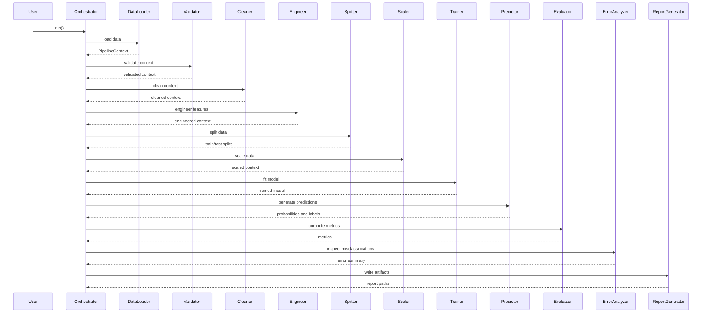

# Sequence Diagram

```mermaid
sequenceDiagram
    participant User
    participant Orchestrator
    participant DataLoader
    participant Validator
    participant Cleaner
    participant Engineer
    participant Splitter
    participant Scaler
    participant Trainer
    participant Predictor
    participant Evaluator
    participant ErrorAnalyzer
    participant ReportGenerator

    User->>Orchestrator: run()
    Orchestrator->>DataLoader: load data
    DataLoader-->>Orchestrator: PipelineContext
    Orchestrator->>Validator: validate context
    Validator-->>Orchestrator: validated context
    Orchestrator->>Cleaner: clean context
    Cleaner-->>Orchestrator: cleaned context
    Orchestrator->>Engineer: engineer features
    Engineer-->>Orchestrator: engineered context
    Orchestrator->>Splitter: split data
    Splitter-->>Orchestrator: train/test splits
    Orchestrator->>Scaler: scale data
    Scaler-->>Orchestrator: scaled context
    Orchestrator->>Trainer: fit model
    Trainer-->>Orchestrator: trained model
    Orchestrator->>Predictor: generate predictions
    Predictor-->>Orchestrator: probabilities and labels
    Orchestrator->>Evaluator: compute metrics
    Evaluator-->>Orchestrator: metrics
    Orchestrator->>ErrorAnalyzer: inspect misclassifications
    ErrorAnalyzer-->>Orchestrator: error summary
    Orchestrator->>ReportGenerator: write artifacts
    ReportGenerator-->>Orchestrator: report paths
```
