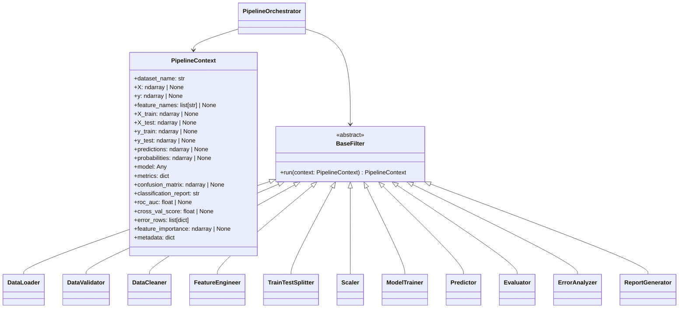

# UML

```mermaid
classDiagram
    class PipelineContext {
        +dataset_name: str
        +X: ndarray | None
        +y: ndarray | None
        +feature_names: list[str] | None
        +X_train: ndarray | None
        +X_test: ndarray | None
        +y_train: ndarray | None
        +y_test: ndarray | None
        +predictions: ndarray | None
        +probabilities: ndarray | None
        +model: Any
        +metrics: dict
        +confusion_matrix: ndarray | None
        +classification_report: str
        +roc_auc: float | None
        +cross_val_score: float | None
        +error_rows: list[dict]
        +feature_importance: ndarray | None
        +metadata: dict
    }

    class BaseFilter {
        <<abstract>>
        +run(context: PipelineContext) PipelineContext
    }

    class DataLoader
    class DataValidator
    class DataCleaner
    class FeatureEngineer
    class TrainTestSplitter
    class Scaler
    class ModelTrainer
    class Predictor
    class Evaluator
    class ErrorAnalyzer
    class ReportGenerator
    class PipelineOrchestrator

    BaseFilter <|-- DataLoader
    BaseFilter <|-- DataValidator
    BaseFilter <|-- DataCleaner
    BaseFilter <|-- FeatureEngineer
    BaseFilter <|-- TrainTestSplitter
    BaseFilter <|-- Scaler
    BaseFilter <|-- ModelTrainer
    BaseFilter <|-- Predictor
    BaseFilter <|-- Evaluator
    BaseFilter <|-- ErrorAnalyzer
    BaseFilter <|-- ReportGenerator

    PipelineOrchestrator --> PipelineContext
    PipelineOrchestrator --> BaseFilter
```
